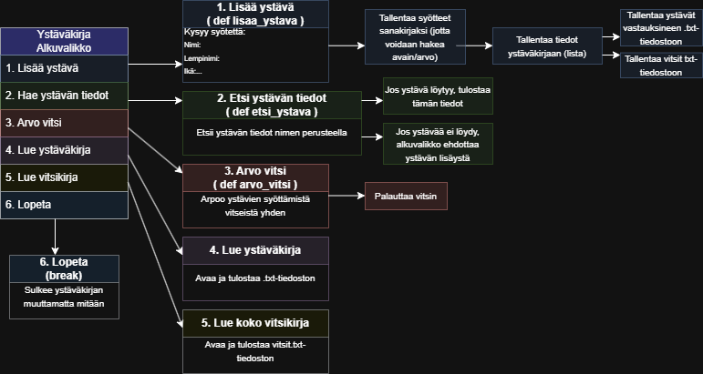

# Ohjelmistoprojekti: ystäväkirja

## Kuvaus
Tekstipohjainen Python-sovellus, jossa käyttäjä
voi lisätä ystäviä, hakea heidän tietojaan ja
lukea kavereiden kirjaamia vitsejä.

## Toiminnot
- Lisää ystävä
- Hae ystävän tiedot nimen perusteella (valmiina kirjassa: Eevi, Elina, Jouko, Mira, Miro)
- Arvo satunnainen vitsi
- Lopeta ohjelma

## Ohjelman rakenne

## Toteutus
Ohjelma on toteutettu Pythonilla käyttäen listaa ja
sanakirjoja tietojen tallentamiseen. Toiminnot on
jaettu omiin funktioihinsa ja ohjelmaa ohjataan
valikon avulla.

## Käynnistysohje
1. Avaa terminaali projektikansiossa
2. Aja komento: python ystavakirja.py
